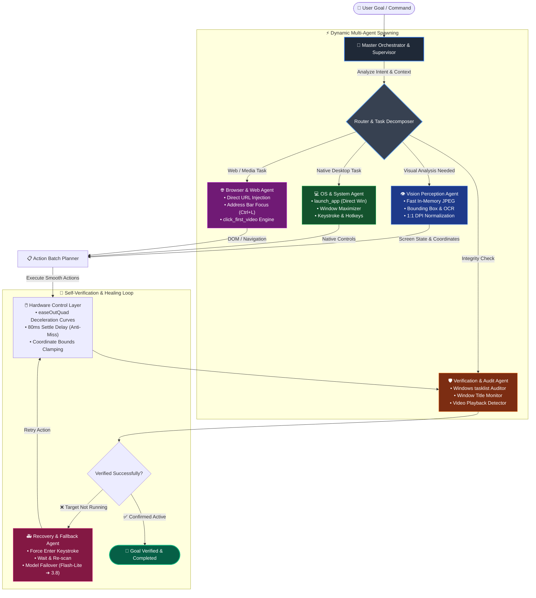

# Complete Multi-Dynamic Agents Desktop Automation

> **High-speed, autonomous, multimodal vision-driven multi-agent system for Windows OS & Browser automation.**

[](https://python.org)
[](https://ai.google.dev/)
[](https://pyautogui.readthedocs.io/)
[](https://microsoft.com/windows)

---

## 1. Overview

**Complete Multi-Dynamic Agents Desktop Automation** is an autonomous desktop and web agent built on Google's state-of-the-art multimodal Large Language Models (`gemini-3.1-flash-lite`, `gemini-3.8-flash`).

Unlike traditional script-based automation (which breaks when UI changes) or naive LLM agents (which suffer from high latency, coordinate drift, and hallucinated completion), this system pairs **real-time visual perception** with **dynamic multi-agent spawning**, **self-verification safeguards**, **per-monitor DPI-aware mouse dynamics**, and **multi-action execution**.

---

## 2. Dynamic Multi-Agent Spawning Flowchart

The system employs an **Adaptive Multi-Agent Orchestration Architecture**. Rather than relying on a single monolith prompt, the Master Supervisor dynamically spawns and coordinates specialized agents based on user intent and real-time screen feedback:



---

## 3. Autonomous Execution & Verification Lifecycle

```mermaid
sequenceDiagram
    autonumber
    actor User as 👤 User
    participant Sup as 🧠 Master Supervisor
    participant Vision as 👁️ Vision Agent
    participant LLM as ⚡ Gemini 3.1 Flash-Lite
    participant Exec as 🖱️ Execution Layer
    participant Verify as 🛡️ Verification Agent

    User->>Sup: "Open chrome and search yeshnagula song and play it"
    Sup->>Vision: Capture primary display (DPI-Aware)
    Vision-->>Sup: Compressed JPEG stream (<250 KB)
    Sup->>LLM: Send Screenshot + Goal + Multi-Action Schema
    LLM-->>Sup: Actions: [open_url(YouTube query), wait(2s), click_first_video()]
    
    rect rgb(30, 41, 59)
        note over Sup,Exec: Fast Multi-Action Batch Execution
        Sup->>Exec: 1. open_url('https://www.youtube.com/results?search_query=...')
        Exec-->>Sup: Launched Chrome directly to search results (0.5s)
        Sup->>Exec: 2. wait(2.0s)
        Sup->>Exec: 3. click_first_video() with easeOutQuad glide
        Exec-->>Sup: Cursor glides smoothly & clicks thumbnail (0.35s)
    end

    Sup->>Verify: Audit task state
    Verify->>Verify: Check process table (chrome.exe) & Window Title ('- YouTube')
    alt Verification Succeeded
        Verify-->>Sup: VERIFIED: 'yeshnagula song - YouTube' active
        Sup-->>User: Goal Verified & Completed in ~3.2s
    else Verification Failed
        Verify->>Exec: Trigger Recovery: Press Enter / Re-click
        Verify-->>Sup: Re-audit confirmed
        Sup-->>User: Recovered & Completed
    end
```



---

## 4. Key Capabilities & Innovations

### ⚡ Lightning-Fast Multi-Action Execution
- Executes common desktop tasks (like launching applications) in **under 3 seconds** instead of minutes.
- Evaluates multi-step action plans in a single model turn, eliminating unnecessary screenshot upload loops.
- In-memory JPEG compression reduces network payload by **>95%** (<250 KB vs ~6 MB raw PNG) with zero loss in visual reasoning fidelity.

### 🎯 Human-Like Smooth Cursor Dynamics (No Jitter)
- **Per-Monitor DPI Awareness**: Automatically configures Windows `SetProcessDpiAwareness(2)` so screen coordinates map **1:1** with physical hardware pixels, eliminating coordinate drift on 125%/150% scaled displays.
- **Natural Deceleration Curves**: Uses `easeOutQuad` easing curves to guide the cursor smoothly to targets, avoiding jarring teleports.
- **DOM Settle Buffer**: Introduces micro-pauses upon arrival so web hover states (`:hover`) and dynamic UI transitions settle before clicks fire.

### 🌐 Native Browser & Web Automation
- **Direct Route Injection (`open_url`)**: Directly navigates to exact search queries and URLs (e.g. YouTube search results) without clumsy, error-prone address bar clicks.
- **Address Bar Focus (`focus_address_bar`)**: Automatically sends `Ctrl+L` before browser input to guarantee focus.
- **Instant Media Targeting (`click_first_video`)**: Automatically calculates and triggers playback on video search results.

### 🛡️ Mandatory Self-Verification
- **Process Table Auditing (`check_app_opened`)**: Cross-references running Windows processes (`tasklist`) to confirm target applications (`notepad.exe`, `chrome.exe`, `calc.exe`) are actually spawned.
- **Window Title Auditing (`check_window_title_contains`)**: Validates that active window titles match requested media or page contents.
- **Completion Interceptor**: Prevents premature `done` calls if the requested application or media has not yet been verified.

---

## 5. Quick Start

### Prerequisites
- Windows 10 or 11
- Python 3.10+
- Google Gemini API Key

### Installation

1. Open **PowerShell** and navigate to the folder:
   ```powershell
   cd desktop_agent
   ```

2. Install dependencies:
   ```powershell
   python -m venv .venv
   .\.venv\Scripts\python.exe -m pip install -r requirements.txt
   ```

3. Configure your Gemini API key in `.env`:
   ```env
   GEMINI_API_KEY="your_api_key_here"
   ```

---

## 6. Usage

Run tasks directly using the batch runner (bypasses Windows PowerShell script policies):

```powershell
.\run.bat "Open Notepad"
```

### Media & Browser Automation
```powershell
.\run.bat "Open chrome and open youtube in it and search yeshnagula song and play it"
```

### System Tasks
```powershell
.\run.bat "Open Calculator and calculate 45 * 12"
```

---

## 7. Safety & Failsafe Mechanisms

1. **PyAutoGUI Failsafe**: Drag your physical mouse to any of the 4 screen corners to immediately abort execution.
2. **Bounds Clamping**: All coordinate outputs from the model are clamped to active monitor bounds `[0, width - 1]` and `[0, height - 1]`.
3. **Graceful Degradation**: Automatically falls back through multiple model tiers (`gemini-3.1-flash-lite` -> `gemini-3.8-flash` -> `gemini-3.7-flash`) during high-demand traffic spikes.

---

## 8. License

MIT License. Designed for agentic AI research, enterprise desktop workflows, and autonomous system operations.